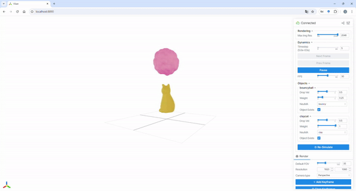

<p align="center">

  <h1 align="center">NeuMA: Neural Material Adaptor for Visual Grounding of Intrinsic Dynamics</h1>
  <p align="center">
    Junyi Cao
    ·
    Shanyan Guan
    ·
    Yanhao Ge
    ·
    Wei Li
    ·
    Xiaokang Yang
    ·
    Chao Ma

  </p>
  <h3 align="center"> <a href="https://arxiv.org/pdf/2410.08257" target="_blank"> Paper </a> &nbsp;&nbsp; | &nbsp;&nbsp; <a href="https://xjay18.github.io/projects/neuma.html" target="_blank"> Website </a> &nbsp;&nbsp; | &nbsp;&nbsp; <a href="#data"> Data </a></h3>
  <div align="center"></div>
</p>


<p align="center">
  <a href="">
    
  </a>
</p>

<p style="text-align:justify">
We propose the Neural Material Adaptor (NeuMA), which integrates existing physical laws with learned corrections, facilitating accurate learning of actual dynamics while maintaining the generalizability and interpretability of physical priors. Additionally, we propose Particle-GS, a particle-driven 3D Gaussian Splatting variant that bridges simulation and observed images, allowing back-propagate image gradients to optimize the simulator. Comprehensive experiments on various dynamics in terms of grounded particle accuracy, dynamic rendering quality, and generalization ability demonstrate that NeuMA can accurately capture intrinsic dynamics.
</p>

**Please consider citing our paper if you find it interesting or helpful to your research.**
```
@InProceedings{Cao_2024_NeuMA,
    author    = {Cao, Junyi and Guan, Shanyan and Ge, Yanhao and Li, Wei and Yang, Xiaokang and Ma, Chao},
    title     = {Neu{MA}: Neural Material Adaptor for Visual Grounding of Intrinsic Dynamics},
    booktitle = {The Thirty-eighth Annual Conference on Neural Information Processing Systems (NeurIPS)},
    year      = {2024}
}
```

---

### Basic Requirements
Please ensure that you have already installed the following packages.

```bash
# Create conda environment
conda create -n neuma python=3.10
conda activate neuma
conda install numpy==1.26.4 pytorch==2.2.1 torchvision==0.17.1 torchaudio==2.2.1 pytorch-cuda=11.8 -c pytorch -c nvidia
pip install opencv-python==4.9.0.80 e3nn==0.5.1 einops==0.8.0 natsort==8.4.0 nerfview==0.0.3 omegaconf==2.3.0 pyvista==0.44.0 splines==0.3.2 torchmetrics tensorboardX tqdm plyfile trimesh mediapy imageio viser==0.2.3 warp-lang==0.6.1

# Install gaussian-splatting
git clone https://github.com/graphdeco-inria/gaussian-splatting --recursive
cd gaussian-splatting
# Checkout the compatible version
git checkout b17ded92b56ba02b6b7eaba2e66a2b0510f27764 --recurse-submodules
pip install submodules/diff-gaussian-rasterization
pip install submodules/simple-knn
cd ..

# Install pytorch3d (see https://github.com/facebookresearch/pytorch3d/blob/main/INSTALL.md)
# NOTE: This step is optional and only necessary if you want to run training on real-world data. 
pip install "git+https://github.com/facebookresearch/pytorch3d.git"

# Clone NeuMA
git clone https://github.com/XJay18/NeuMA.git
cd NeuMA
export PYTHONPATH=$PWD
```

### Data

We consider both synthetic and real-world data in our experiments. 
- The synthetic data is crafted by ourselves and can be accessed via [this link](https://1drv.ms/u/c/3f1ccc11f481c100/EZUKCz9lrVBLquZGaXqvF1IB_XVKBBx4BK2LAt8GuFpVZQ?e=ub9Jek). For more information, please refer to Appendix B of our paper.
- The real-world data is collected by Spring-Gaus[^1] and our preprocessed version can be accessed via [this link](https://1drv.ms/u/c/3f1ccc11f481c100/Edqcvj_qOK9HgWycdfX53UMBn-5XTTh3VDcu56CcNEzx6A?e=LT0R1j). For more information, please refer to Section 4.1 of Spring-Gaus.

Please make sure to download and unzip the data before executing the following commands.

[^1]: Licheng Zhong, Hong-Xing Yu, Jiajun Wu, and Yunzhu Li. Reconstruction and simulation of elastic objects with spring-mass 3D gaussians. In ECCV, 2024.

### Dynamics Grounding

Please first check the configuration files stored in [`experiments/configs`](experiments/configs) and make some necessary modifications to those lines with annotations. You may then start a new experiment for dynamics grounding by running the following command in the console:

<details>
<summary>On Synthetic Data</summary>

```bash
CUDA_VISIBLE_DEVICES=0 python experiments/finetune.py -c experiments/configs/synthetic/finetune-${OBJECT_NAME}.yaml
```

- Note: `${OBJECT_NAME}` should be one of the six items in the list `[bb, cc, hb, jd, rp, sf]` (stands for BouncyBall, ClayCat, HoneyBottle, JellyDuck, RubberPawn, and SandFish, respectively).

</details>

<details>
<summary>On Real-world Data</summary>

```bash
# Registration Stage (See Section 4.2 of Spring-Gaus for details)
CUDA_VISIBLE_DEVICES=0 python experiments/regist.py -c experiments/configs/realworld/regist-${OBJECT_NAME}.yaml
```

```bash
# Dynamics Grounding Stage
CUDA_VISIBLE_DEVICES=0 python experiments/finetune.py -c experiments/configs/realworld/finetune-${OBJECT_NAME}.yaml
```

- Note: `${OBJECT_NAME}` should be one of the four items in the list `[bun, burger, dog, pig]`.

</details>

Running logs and checkpoints will be saved to `experiments/logs/${EXP_NAME}`.

### Pretrained Neural Material Adaptors

In case you do not have enough GPU resources[^2] to conduct dynamics grounding experiments, we have provided some pretrained checkpoints [here](https://1drv.ms/f/c/3f1ccc11f481c100/EgQDL270OjxDmbXQhMB-IbcBwK89e2xQkpZCrWmlxsQC6A?e=GhJlH9). You will see two folders `assets` and `logs`. You may put them under the [`experiments`](experiments) directory and then use these pretrained adaptors for the following experiments (which require much less GPU memory).

### Dynamics Rendering

When dynamics grounding is finished, you may render image sequences using the learned neural material adaptor by running the following command in the console:

>Please note that if you skip dynamics grounding and directly use our pretrained checkpoints, you should first modify the value of `video_data/data/path` to the correct dataset path in configuration files. Generally, you do not need to modify other items in these files for dynamics rendering.

<details>
<summary>On Synthetic Data</summary>

```bash
# Example for synthetic data
CUDA_VISIBLE_DEVICES=0 python experiments/render.py \
  -c experiments/configs/synthetic/finetune-${OBJECT_NAME}.yaml \
  --eval_steps 400 \
  --transform_file 'eval_dynamic.json' \
  --load_lora 1000_lora.pt \
  --video_name ${VIDEO_NAME} \
  --debug_views e_${VIEW} \
  --skip_frames 5
```

- Note: `${OBJECT_NAME}` should be one of the six items in the list `[bb, cc, hb, jd, rp, sf]` (stands for BouncyBall, ClayCat, HoneyBottle, JellyDuck, RubberPawn, and SandFish, respectively).

</details>

<details>
<summary>On Real-world Data</summary>

```bash
# Example for real-world data
CUDA_VISIBLE_DEVICES=0 python experiments/render.py \
  -c experiments/configs/realworld/finetune-${OBJECT_NAME}.yaml \
  --eval_steps 400 \
  --load_lora 1000_lora.pt \
  --video_name ${VIDEO_NAME} \
  --debug_views r_${VIEW} \
  --skip_frames 5
```

- Note: `${OBJECT_NAME}` should be one of the four items in the list `[bun, burger, dog, pig]`.

</details>

Note: 

`--eval_steps`: Number of simulation steps.

`--load_lora`: Name of the pretrained neural material adaptor stored in the folder `experiments/logs/${EXP_NAME}/finetune`. If not specified, only the base model (i.e., $\mathcal{M}_0$) will be used.

`--video_name`: Name of the rendered video.

`--debug_views`: A list of camera view(s) to render video. `${VIEW}` should be a number. Please note there is a preceding letter for each camera view.

`--skip_frames`: Number of skip frames when packing the video. E.g., `--skip_frames 5` means we select every 5th frame when packing the video.

The rendered video will be saved to `results/${EXP_NAME}`.

### Dynamics Generalization

We implement an interactive viewer to visualize dynamics generalization results. To use it, you may run the following command in the console:

>Generally, you do not need to modify the configuration files stored in [`experiments/configs/demo`](experiments/configs/demo) if you use the interactive viewer, even if you skip dynamics grounding and directly use our pretrained checkpoints.

```bash
CUDA_VISIBLE_DEVICES=0 python experiments/visualization.py -c experiments/configs/demo/multiobj-bb-cc.yaml --eval-steps 400 --port 8890
```

Then, you could enter `http://localhost:8890` to view the result like this:

<p align="center">
    
</p>

### Acknowledgement
This codebase is built upon 3DGS[^3] and NCLaw[^4]. We thank all the authors for their great work and repos! We would also like to thank Shiju Zhang for his help in using Blender in this work.

---

Please feel free to contact Junyi Cao (xjay2018@gmail.com) if you have any questions about this work.

[^2]: We use an 80G A100 GPU for training.
[^3]: https://github.com/graphdeco-inria/gaussian-splatting
[^4]: https://github.com/PingchuanMa/NCLaw
